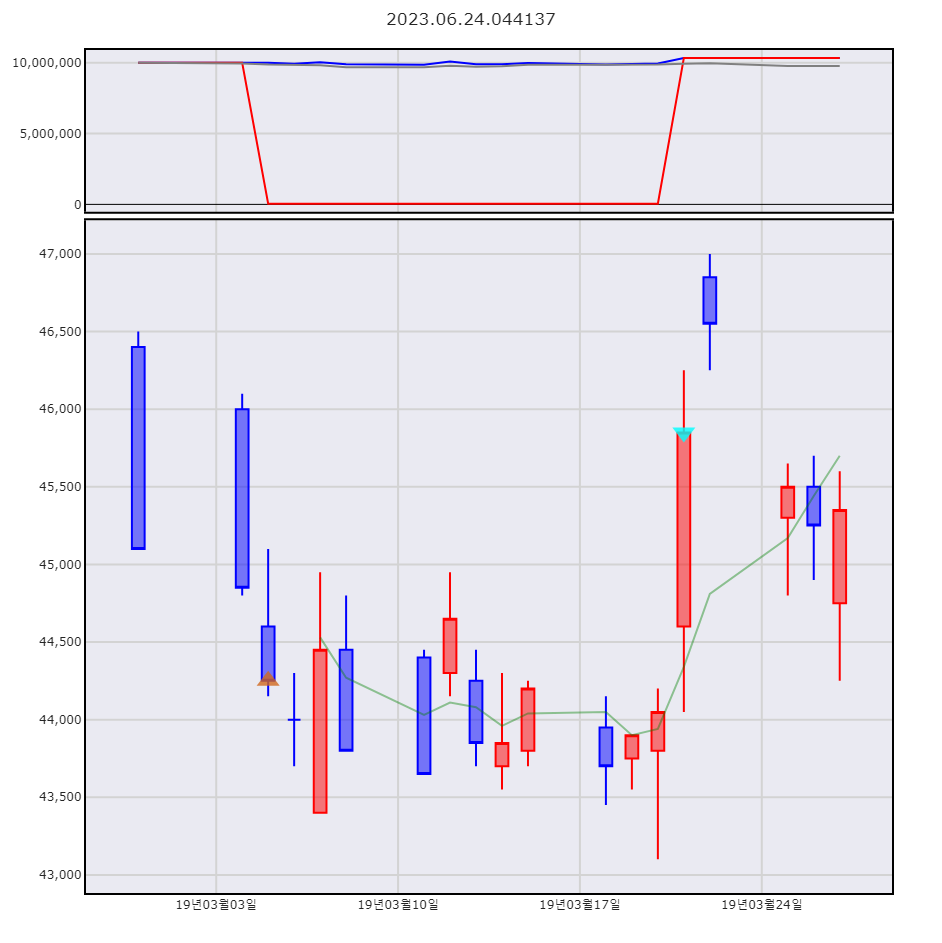

# stock_backtest
- python으로 차트기반 백테스트를 진행할 수 있습니다.
- OHLC 데이터는 직접 수집하셔야 합니다.
- 제한적(?)으로 조건을 직접 입력할 수 있습니다.

# 유의사항
- 동작에 불완전한 부분과 버그가 존재할 수 있습니다.
- 이에 따라 언제든 코드가 변경될 수 있습니다.
- 취미로 코딩을 하고 있습니다. 비판 받습니다.

# 사용법
[main_예시.py](https://github.com/potatohead78/stock_backtest/blob/main/main_%EC%98%88%EC%8B%9C.py) 를 참조해주세요.
1. OHLC 데이터를 데이터프레임으로 만들기
```
df_ohlc = pd.DataFrame(rows, columns=columns, index=index)
```
2. 총 투자금 입력하기
```
total_money = 10000000
```
3. 매수매도 조건을 입력하기 (딕셔너리)
```
condition = {
                "Buy":"['MFI5'] < 20",
                "Sell":"['MFI5'] > 80",
                "Buy_price":"['close']",
                "Sell_price":"['close']"
                }
```
4. 결과
```
df_result = Backtest_single(total_money, df_ohlc).simulation(condition)
```
5. 그래프
```
Plotting().single(df_result)
```
</img>
